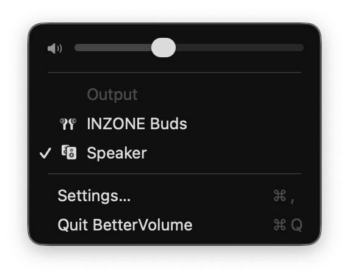
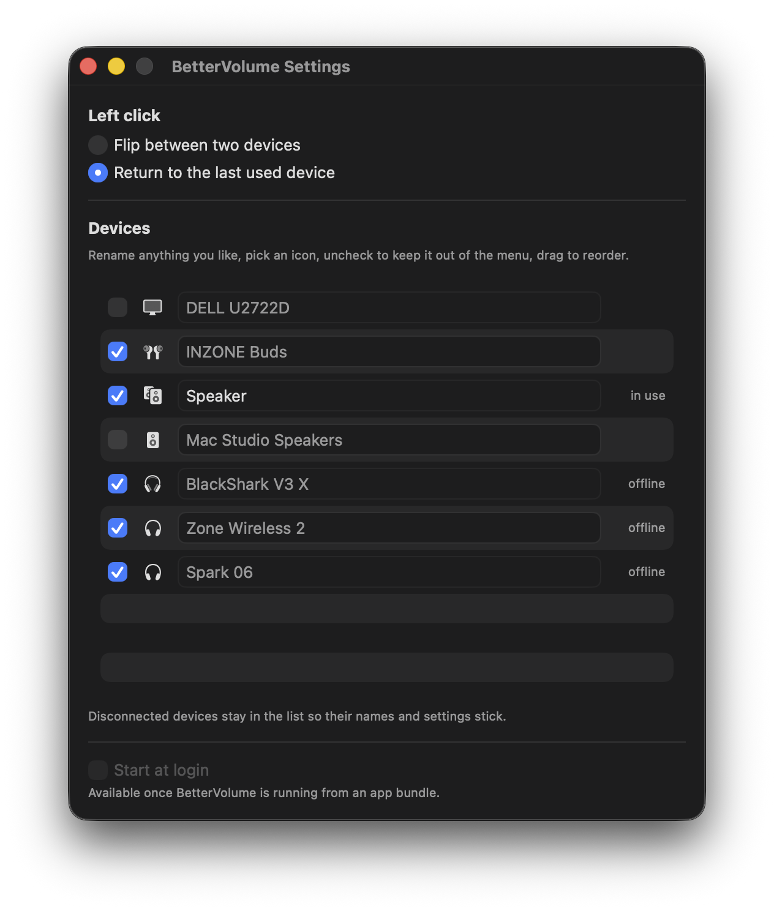

> [!NOTE]
> This project is developed and used on a single Mac. It works well there, but it has not been
> tested widely. Bug reports welcome.

# BetterVolume

[](https://github.com/ldinino/BetterVolume/actions/workflows/ci.yml)

A macOS menu bar replacement for Apple's Sound control, built around one idea: **switching
between the two outputs you actually use should be a single click.**

- **Left click** — flip between your two outputs.
- **Right click** — the full device menu, with a volume slider.
- **Rename** anything. Your speakers don't have to be called "External Headphones" just because
  they're plugged into the 3.5 mm jack.
- **Pick an icon** per device, from 26 SF Symbols, or leave it on automatic.
- **Hide** devices you never use so the menu stays short.

No third-party dependencies. Swift 6, SwiftPM, under 1,500 lines of Swift.

<p align="center">
  
</p>

## Why

macOS makes you option-click the Sound icon and pick from a list every single time. If you go
back and forth between speakers and headphones twenty times a day, that's twenty needless menus.
BetterVolume collapses it to a click, and lets you make the device list actually readable.

## Requirements

- macOS 14 or later (developed on macOS 26)
- Swift 6 toolchain (Xcode 16+) to build

## Install

```sh
git clone https://github.com/ldinino/BetterVolume.git
cd BetterVolume
Scripts/build.sh install
```

That builds a release binary, assembles `BetterVolume.app`, signs it, and copies it to
`/Applications`. Launch it from there.

Signing uses a *Developer ID Application* certificate from your keychain if you have one, and
falls back to an ad-hoc signature if you don't. Ad-hoc works fine locally, but macOS treats each
rebuild as a new app, so permissions and the login-item registration reset every time.

To retire Apple's own control: System Settings → Control Center → Sound → **Don't Show in Menu
Bar**. Then ⌘-drag BetterVolume into the spot it left behind.

## Usage

| Action | Result |
|---|---|
| Left click | Switch to the other output |
| Right click (or ⌃-click) | Device menu, volume slider, settings |
| Keyboard shortcut | Same as a left click, from any app (optional) |
| Hover | Tooltip showing the current output and where a click will take you |

Every switch shows a brief panel in the lower third of the screen — the device's icon and its
name, fading in and out like the system volume HUD. It sits above full-screen apps, so a
shortcut press inside a game still tells you where the sound went.

**Left click behaviour** is configurable in Settings:

- **Flip between two devices** — pick a pinned pair; the click always flips between them. If the
  current output isn't one of the pair, the click jumps you into it.
- **Return to the last used device** — the click goes back to whatever you were on before.

A half-configured pair falls back to most-recently-used rather than doing nothing.

## Settings

Right click → Settings…

<p align="center">
  
</p>

- **Rename** — type in any row. Names are display-only aliases; Core Audio doesn't let apps
  rename devices.
- **Icons** — click the icon in a row to choose one, or leave it on Automatic (guessed from the
  device name and transport).
- **Hide** — uncheck a device to keep it out of the menu. It stays switchable from Settings and
  is still honoured if it's pinned.
- **Reorder** — drag rows to set the menu order.
- **Keyboard shortcut** — click *Record shortcut* and press a key to switch outputs from
  anywhere. A function key (F1–F20) is accepted on its own, so a spare key on a programmable
  keyboard works; every other key needs ⌘, ⌥, ⌃ or ⇧. Registered through Carbon, so macOS
  asks for no Accessibility permission.
- **Start at login** — available once you're running from the app bundle.

Disconnected devices stay in the list so their names, icons and pins survive unplugging. Device
identity is tracked by UID, then model UID + name, then name — USB UIDs churn across reconnects,
so matching on UID alone loses your settings.

## What it deliberately doesn't do

Being honest about the trade-offs, all of which were verified against Core Audio rather than
assumed:

- **No AirPlay.** AirPlay targets in Control Center are not Core Audio devices — they're
  invisible to any app using the HAL. If you need AirPlay, keep Apple's Sound item around.
- **No volume for USB or HDMI outputs.** Those devices expose no volume control at all. macOS
  can't change their level either (`osascript -e 'get volume settings'` returns
  `output volume: missing value`). The slider shows maxed and disabled to match, rather than
  faking it.
- **Output devices only.** No microphone or input switching.
- **Renames are ours, not the system's.** `kAudioObjectPropertyName` isn't settable, so other
  apps still see the hardware name.

## Architecture

| Target | Responsibility |
|---|---|
| `Sources/AudioRouting` | Pure logic — device identity, reconciliation, toggle resolution, settings, icon selection. No AppKit, no Core Audio. All tests point here. |
| `Sources/AudioHAL` | The only code that talks to Core Audio. |
| `Sources/BetterVolumeApp` | AppKit status item and SwiftUI settings window. |

`AppModel` is the single `@Observable` source of truth; SwiftUI observes it directly and the
AppKit status item redraws through a change callback. Keeping the routing logic free of AppKit
and Core Audio is what makes it testable without audio hardware or a run loop.

## Development

```sh
Scripts/build.sh test       # unit tests
Scripts/build.sh run        # run the agent from the terminal
Scripts/build.sh app        # assemble + sign BetterVolume.app
Scripts/build.sh install    # app + copy to /Applications
Scripts/build.sh clean
```

Everything builds into `~/Library/Caches/BetterVolume-build`. Signing and bundling live in the
script, so use it rather than plain `swift build`.

`swift tools/audio-probe.swift` dumps what Core Audio reports about your devices — which
properties are settable, which have volume control, what the UIDs look like. Handy when a
platform assumption needs re-checking.

[PLAN.md](PLAN.md) has the full feasibility analysis: what was tested, what Core Audio actually
allows, and why each product decision went the way it did.

## Distribution

The app is Developer ID signed with a hardened runtime and secure timestamp, but **not
notarised**. That's fine locally — a locally built app never gets a quarantine attribute — but
notarisation is required before sending the app to anyone else. The commands are in
[PLAN.md](PLAN.md).

## License

MIT — see [LICENSE](LICENSE).

The app icon is not mine: it's *multimedia-volume-control* from KDE's
[Oxygen icon theme](https://invent.kde.org/frameworks/oxygen-icons), by the Oxygen Team, used
under the LGPL v3. Open source all the way down. Full attribution, the licence texts and
instructions for swapping the icon out are in [THIRD-PARTY-NOTICES.md](THIRD-PARTY-NOTICES.md);
the same credit is in the app's own About panel.
